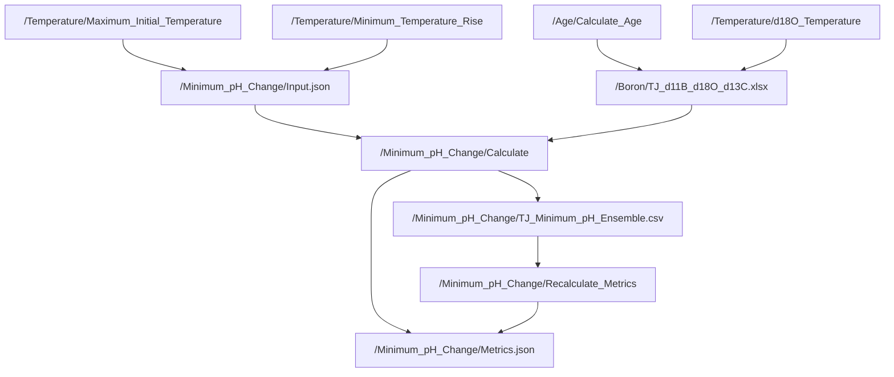
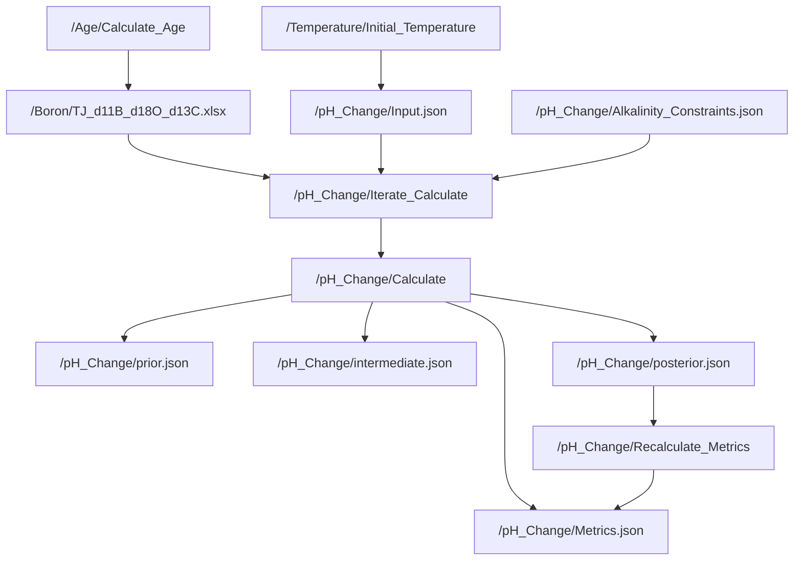

# Code
## Dependencies
This repository uses [DVC](https://dvc.org/) to store a large data file and figures. If you want to download these files install DVC and run ```dvc pull```.

### Submodules
CO2_Systematics performs some CO2 calculations and is found [here](https://github.com/St-Andrews-Isotope-Geochemistry/CO2_Systematics). For this paper the 'script' branch was used, which is a version of csys which has been updated to use equilibrium coefficients for carbonate chemistry from the [MyAMI model](https://github.com/St-Andrews-Isotope-Geochemistry/MyAMI).

BuCC performs most of the carbonate chemistry calculations for this paper, and is found [here](https://github.com/St-Andrews-Isotope-Geochemistry/BuCC). It is an object oriented implementation of carbonate chemistry calculations.

Geochemistry_Helpers provides some useful classes to represent geochemical concepts (such as pX, which represents pH, and delta to represent isotope measurements on the delta scale). Sampling and Distribution classes are also found in this repository. It can be found [here](https://github.com/St-Andrews-Isotope-Geochemistry/Geochemistry_Helpers).


## Analysis
### <ins>Age</ins>
#### Calculate_Age
The calculate age script takes values in [TJ_Age_Calibation](./Data/TJ_Age_Calibration.xlsx) (Matlab sheet) and performs a piecewise linear interpolation to get the age of samples in [TJ_d11B](./Data/TJ_d11B_d13C_d18O.xlsx). Original columns are replicated and new columns for age are added into the *With_Age* sheet.

### <ins>Temperature</ins>
#### Calculate_d18O_Temperature
Combines the measured &delta;<sup>18</sup>O in [TJ_d11B](./Data/TJ_d11B_d13C_d18O.xlsx) (sheet *With_Age*) and &delta;<sup>18</sup>O<sub>sw</sub> from [d18O_sw_Petryshyn](./Data/d18O_sw_Petryshyn.json) to calculate the temperature using four temperature calibrations, which are saved (alongside original columns) in [TJ_d11B](./Data/TJ_d11B_d13C_d18O.xlsx) (sheet *Temperature_Calibrations*)

The change in temperature is calculated using the Hansen calibration, and saved to [TJ_d11B](./Data/TJ_d11B_d13C_d18O.xlsx) (also in sheet *Temperature_Calibrations*). Uncertainty in the change in temperature is assumed equal to the uncertainty in the Hansen calibration.

### <ins>Minimum pH Change</ins>
#### Maximum_Initial_pH_Basic
Calculates the maximum initial pH based on individual values for all inputs (no propagation of uncertainty). This is done using two carbonate chemistry libraries to ensure parity.

#### Calculate
Calculates pH from the &delta;<sup>11</sup>B values in [TJ_d11B](./Data/TJ_d11B_d13C_d18O.xlsx). Uncertainties are propagated using a latin hypercube technique to estimate the extrema of input parameters which would act to minimise pH change. Output is saved as [TJ_Minimum_pH_Ensemble.csv](./../Data/Minimum_pH_Change/TJ_Minimum_pH_Ensemble.csv).

#### Recalculate_Metrics
Recalculates statistics for [TJ_Minimum_pH_Ensemble](./../Data/Minimum_pH_Change/TJ_Minimum_pH_Ensemble.csv) using [TJ_Minimum_pH_Ensemble.csv](./../Data/Minimum_pH_Change/TJ_Minimum_pH_Ensemble.csv) without redoing the entire calculation.

#### Individual_Sensitivity
Calculates pH change while varying each input parameter independently, in order to establish the sensitivity of results to a each indepedent parameter.


### <ins>pH_Change</ins>
#### CO2_Evolutions
Calculates pH and atmospheric CO<sub>2</sub> concentration from the &delta;<sup>11</sup>B values in [TJ_d11B_pH](./../Data/TJ_d11B_pH.xlsx). Uncertainties are propagated taking the values in [CO2_Evolutions_Input](./Analysis/pH_Change/CO2_Evolutions_Input.json) using a latin hypercube technique, and complex resampling to ensure that all constraints are met.

#### Iterate_CO2_Evolutions
Used to repeat the analysis [CO2_Evolutions](./Analysis/pH_Change/CO2_Evolutions.m), generating additional statistical samples, which are saved to [TJ_CO2_Evolutions](./../Data/TJ_CO2_Evolutions.csv).

#### Recalculate_Metrics
Parses the results in [TJ_CO2_Evolutions](./../Data/TJ_CO2_Evolutions.csv) to produce metrics (such as median and standard deviation) without rerunning the full calculation.

#### Recalculate_Metrics_Delta
Parses the results in [TJ_CO2_Evolutions](./../Data/TJ_CO2_Evolutions.csv) to produce metrics (such as median and standard deviation) for the change in pH and CO<sub>2</sub> without rerunning the full calculation.

#### Individual Sensitivity
As above for the minimum pH change method, we estimate the sensitivity of pH change to input parameters by varying each independently across range explored in this study. The exception is CO<sub>2</sub>, which is so strongly correlated with pH it would entirely dominate the graph if shown. Low CO<sub>2</sub> is used as the basis for comparison as all samples are valid, whereas at higher CO<sub>2</sub> changes to other parameters do not result in a valid pH.

#### High_Initial_CO2_Test
We find that our results are incompatible with a high background CO<sub>2</sub> concentration. This scripts tests the reason for this by running only high CO<sub>2</sub> samples so the basis can be established.

## Plots
### <ins>Minimum pH Change</ins>
#### Individual_Sensitivity
Plots results from [Individual Sensitivity](./../Analysis/Minimum_pH_Change/Individual_Sensitivity) analysis to show how sensitive &Delta;pH is to the various input parameters.

### <ins>pH Change</ins>
#### Climate_Sensitivity
Plots the &Delta;temperature against &Delta;CO<sub>2</sub> to estimate climate sensitivity.

#### CO2_Evolutions_Metrics_pH_CO2_SaturationState
Summary figure showing output time series for pH, &Delta;CO<sub>2</sub> and saturation state.

#### Individual_Sensitivity
Plots results from [Individual Sensitivity](./../Analysis/pH_Change/Individual_Sensitivity) analysis to show how sensitive &Delta;pH is to the various input parameters.

## Minimum pH Change Summary


## pH Change Summary

